# 🎬 MovieFav - Flutter Movie App

A beautiful, modular Flutter application for browsing and favoriting movies. Designed with clean architecture and theming, powered by Firebase and remote/local data layers.

---

## 🚀 Features

- 🔐 Firebase Authentication
  - Email verification
  - Sign up / Sign in / Forgot password

- 🎞 Browse Movies
  - View trending and latest movies
  - Search for specific titles

- ⭐ Favorites
  - Add/remove movies to your favorite list
  - Favorites stored per user

- 🎨 Theming
  - Dark theme with custom colors (`app_color.dart`)
  - Responsive and clean UI design

- 🧱 Modular Architecture
  - `core`, `features`, `services`, `data`, `domain`, `presentation`
  - Uses Cubit/Bloc (if applicable) for state management

- 📦 Local & Remote data sources
  - Caches data locally for performance
  - Uses remote APIs for movie info

---

## 📁 Folder Structure


├── core/ # Constants, enums, services, theme
├── firebase/ # Firebase setup
├── modules/
│ ├── auth/ # Sign in, sign up, forgot password
│ ├── home/ # Home page movies + favorites
│ ├── search/ # Search functionality
│ └── view_movie/ # Movie details view
├── shared/ # Reusable widgets and icons
└── main.dart # App entry point

yaml
Copy
Edit

---

## 🧪 Setup Instructions

### ✅ Prerequisites

- Flutter SDK (Stable channel)
- Firebase project set up
- `.env` file (for API keys or Firebase config)

### 🔧 Run the App

```bash
flutter pub get
flutter run
Make sure to add your .env file in the root and keep it out of version control.

🌐 API & Data Sources
Movie data comes from a remote source (e.g., TMDB or your custom API)

Firebase handles authentication and possibly favorite movie storage per user

🎨 App Colors
Defined in app_color.dart:

Primary: #85924B

Secondary: #24303E

Variant: #16121F

🛠️ TODO / Coming Soon
 Implement genre-based browsing

 Add user profile with editable settings

 Unit & widget testing

 Offline mode with full caching

📷 Screenshots

## 📱 App Screenshots

### 🏠 Home Screen
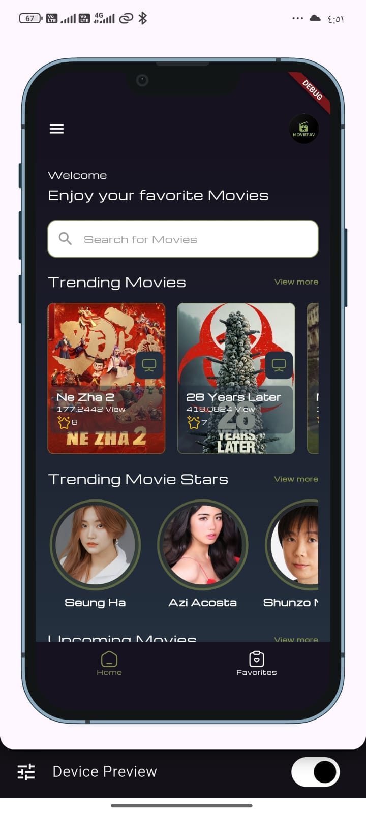

---

### 🔐 Login & Sign Up
#### 🔑 Login
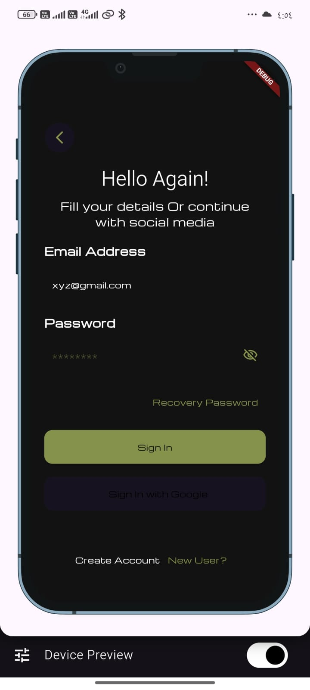

#### 🆕 Sign Up
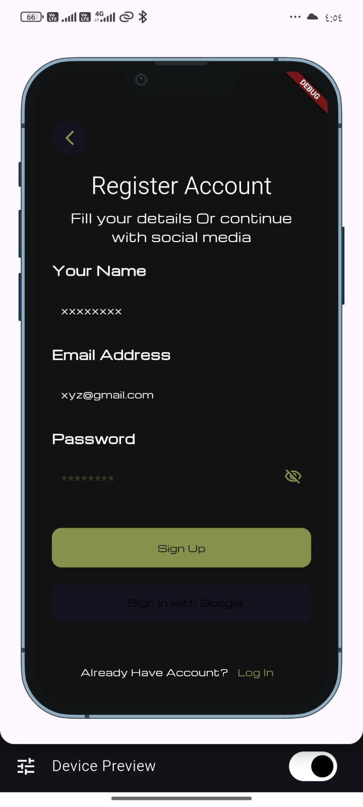

---

### 🎬 Movie Details
#### Movie D1
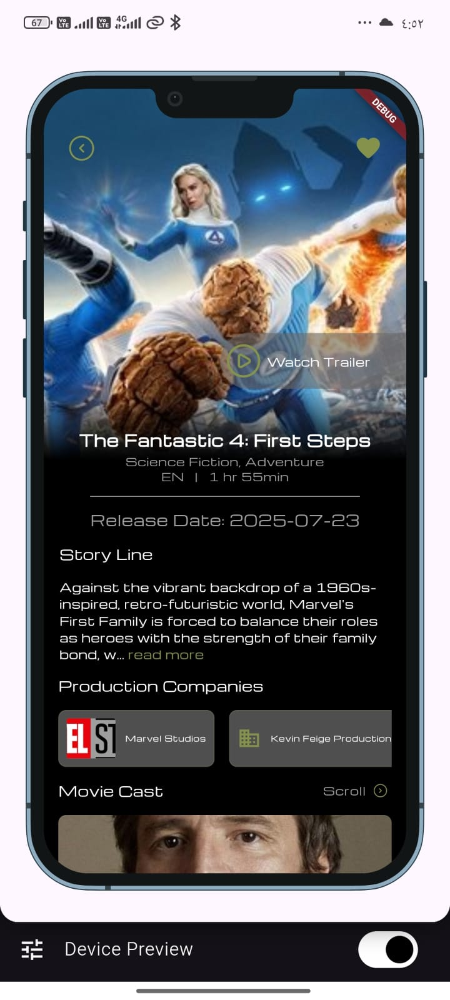
#### Movie D2
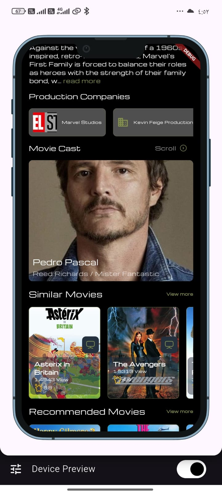
#### Movie D3


---

### ⭐ Movie Stars
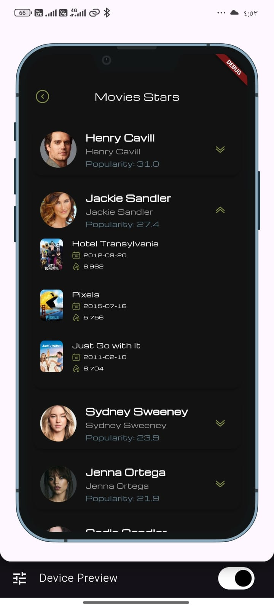

---

### ❤️ Favorite Screen
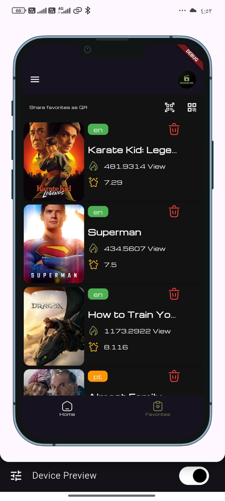

---

### 🔍 Search Screens
#### Search 1
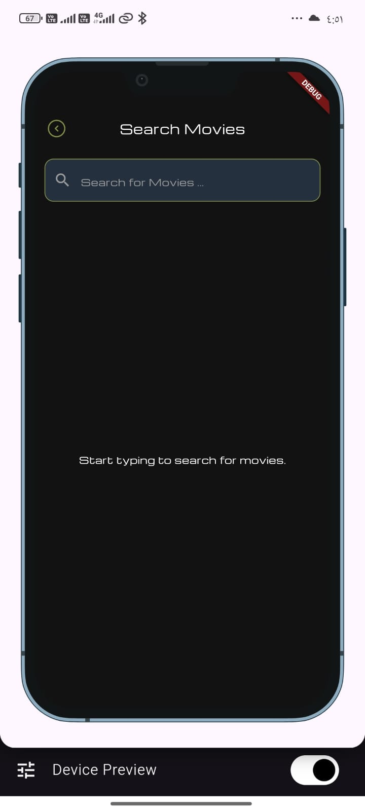
#### Search 2
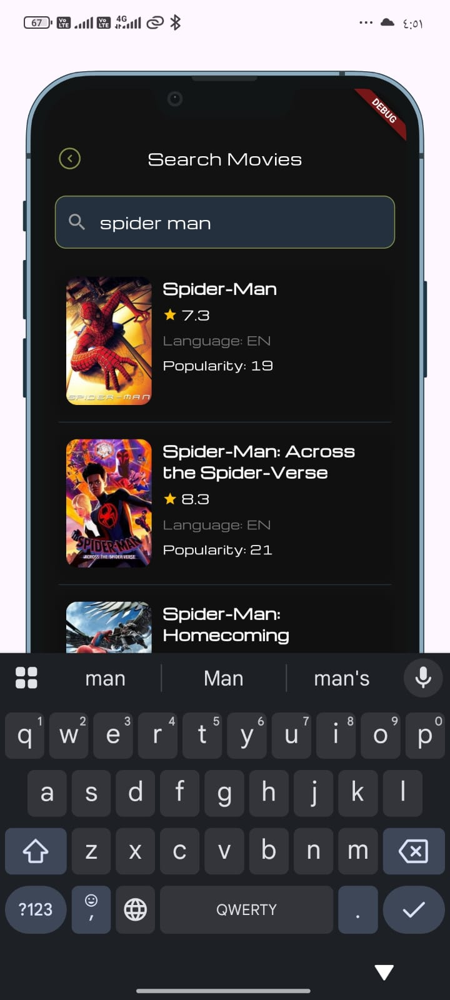

---

### 📂 Show All & Drawer
#### Show All
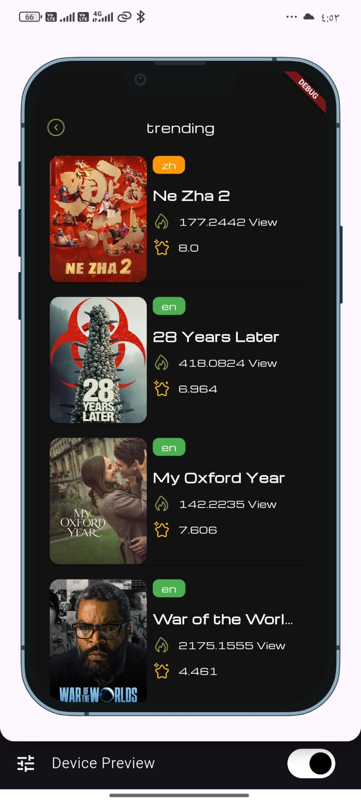

#### Drawer
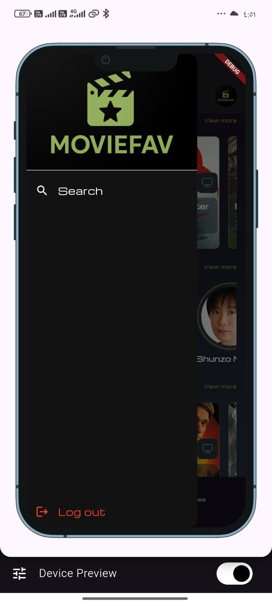

---

### 🎞️ Movie V
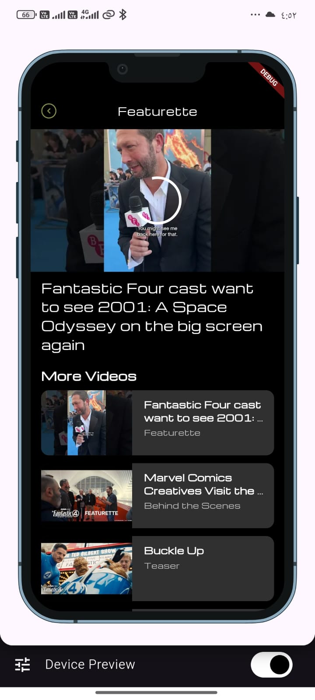


👨‍💻 Author
Mohamed El-Refaie
💼 LinkedIn | 🧑‍💻 Flutter Developer

